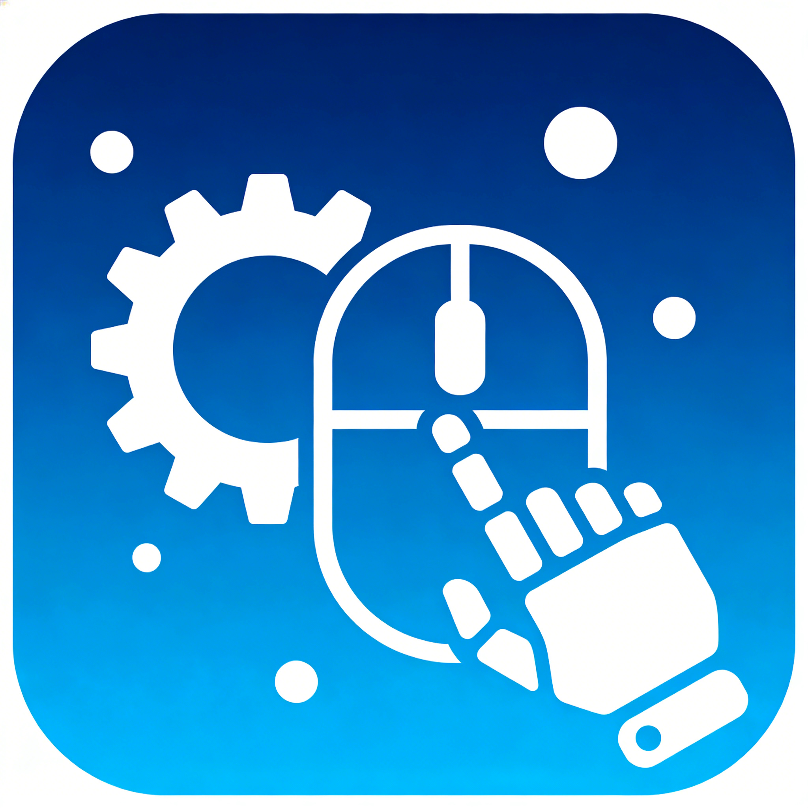

# simpleRPA

<div align="center">



**一个简单易用的 RPA（机器人流程自动化）框架**

[](https://www.gnu.org/licenses/gpl-3.0)
[](https://www.python.org/downloads/)
[](https://www.microsoft.com/windows)

</div>

## 简介

simpleRPA 是一个基于 Python 的简单 RPA 框架，最初是为了实现三国杀小程序自动领取每日奖励而开发的。它提供了直观的图形界面，让用户可以通过可视化方式创建、编辑和执行自动化脚本，无需编写代码。

## 主要特性

- 🎨 **可视化操作** - 直观的图形界面，无需编程基础
- 🖱️ **动作录制** - 支持录制鼠标和键盘操作
- 📦 **动作组管理** - 保存和复用常用动作组合
- 🔄 **循环执行** - 支持有限次数和无限循环执行
- ⚡ **速度控制** - 可调节执行速度（0.1x - 10x）
- 💾 **状态保存** - 自动保存和恢复工作状态
- 🎯 **窗口绑定** - 支持绑定特定窗口进行操作
- 📤 **脚本导出** - 可导出为 Python 脚本

## 安装

### 环境要求

- Python 3.9 或更高版本
- Windows 操作系统

### 使用 pip 安装

```bash
git clone https://github.com/E7G/simpleRPA.git
cd simpleRPA
pip install -r requirements.txt
```

### 使用 Pixi 安装（推荐）

```bash
git clone https://github.com/E7G/simpleRPA.git
cd simpleRPA
pixi install
```

## 快速开始

### 启动程序

```bash
python main.py
```

或使用 Pixi：

```bash
pixi run start
```

### 基本使用流程

1. **录制动作**
   - 点击左侧面板的"开始录制"按钮
   - 执行你想要自动化的操作
   - 点击"停止录制"完成

2. **编辑脚本**
   - 在脚本编辑器中查看录制的动作
   - 可以添加、删除、修改动作
   - 支持拖拽调整动作顺序

3. **执行脚本**
   - 设置执行速度和重复次数
   - 点击"运行"按钮开始执行
   - 可随时点击"停止"按钮中断

4. **保存脚本**
   - 点击"保存"按钮保存当前脚本
   - 下次启动时自动恢复

## 功能说明

### 支持的动作类型

- 🖱️ 鼠标点击（左键、右键、双击）
- ⌨️ 键盘输入
- 🖼️ 图像识别点击
- ⏱️ 延时等待
- 📋 文本复制/粘贴
- 🎯 窗口操作

### 动作组管理

将常用的动作组合保存为动作组，方便快速复用：

1. 选择多个动作
2. 右键选择"保存为动作组"
3. 输入名称和描述
4. 之后可通过左侧面板快速添加

### 执行控制

- **执行速度**：0.1x - 10x 可调
- **重复次数**：1 - 999 次
- **无限循环**：勾选后无限执行
- **超时设置**：设置自动停止时间

## 项目结构

```
simpleRPA/
├── core/           # 核心功能模块
│   ├── actions.py      # 动作定义
│   ├── action_group.py # 动作组管理
│   ├── player.py       # 脚本执行器
│   ├── recorder.py     # 动作录制器
│   └── exporter.py     # 脚本导出器
├── gui/            # 图形界面模块
│   ├── main_window.py  # 主窗口
│   ├── action_panel.py # 动作面板
│   ├── property_panel.py # 属性面板
│   └── ...
├── utils/          # 工具模块
├── docs/           # 文档
├── tests/          # 测试文件
├── main.py         # 程序入口
├── requirements.txt # 依赖列表
└── pixi.toml       # Pixi 配置
```

## 文档

详细使用说明请查看 [用户指南](docs/USER_GUIDE.md)

## 依赖项

- PyQt5 - 图形界面框架
- pyautogui - 自动化操作
- pynput - 输入设备控制
- Pillow - 图像处理
- pywin32 - Windows API
- pyqt-fluent-widgets - Fluent 风格组件

## 构建可执行文件

```bash
pip install pyinstaller
pyinstaller --onefile --windowed --name SimpleRPA main.py
```

或使用 Pixi：

```bash
pixi run build
```

## 贡献

欢迎贡献代码、报告问题或提出建议！

1. Fork 本仓库
2. 创建你的特性分支 (`git checkout -b feature/AmazingFeature`)
3. 提交你的更改 (`git commit -m 'Add some AmazingFeature'`)
4. 推送到分支 (`git push origin feature/AmazingFeature`)
5. 开启一个 Pull Request

详细贡献指南请查看 [CONTRIBUTING.md](CONTRIBUTING.md)

## 许可证

本项目采用 [GPL-3.0 License](LICENSE) 开源许可证。

## 致谢

感谢所有为本项目做出贡献的开发者！

## 联系方式

- 项目主页：https://github.com/E7G/simpleRPA
- 问题反馈：https://github.com/E7G/simpleRPA/issues

---

<div align="center">

**如果这个项目对你有帮助，请给一个 ⭐️ Star！**

</div>
